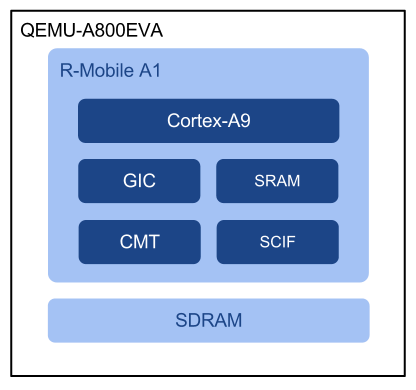
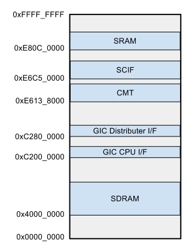

##################################################
Armadillo-800 EVA エミュレータ
##################################################

========
はじめに
========

概要と目的
-----------

オープンソースのマシンエミュレータである QEMU に、
Armadillo-800 EVA のエミュレーションを追加しました。

現行の QEMU には Cortex-A9 エミュレーションがサポートされているため、
今回、Armadillo-800 EVA 向けの Linux カーネルを起動させることを目標に、
R-Mobile A1 の固有部分の一部を実装しました。

R-Mobile A1 はハードウェアマニュアルが一般に公開されていませんが、
ゲスト OS として Linux カーネルが起動するエミュレータを作成することにより、
ハードウェアの概要を掴むことが主な目的です。

環境とソフトウェアについて
--------------------------

ビルド、及び動作確認を行った環境は以下のとおりです。

- Debian GNU/Linux 6.0.2
- Ubuntu 11.10

また、今回使用した各種ソフトウェアのバージョンを以下に示します。

================== ===========================================
 ソフトウェア       バージョン          
================== ===========================================
 QEMU               1.1.1-1
 Linux カーネル     2.6.35-a800eva-at2
 Buildroot          2012.05
================== ===========================================

=========================================
ビルド手順
=========================================

凡例
----

ビルド手順で示されるコマンドラインの種別は以下のとおりです。

::

 # (特権によるコマンドラインを示します)

::

 % (非特権のコマンドラインを示します)

準備
----

環境に応じてビルドに必要なパッケージを導入します。

::

 (Debian 6.0.2 システムインストール直後の場合)
 # apt-get install g++ bison flex gettext glib2.0-dev uboot-mkimage

::

 (Ubuntu 11.10 システムインストール直後の場合)
 # apt-get install g++ bison flex gettext glib2.0-dev u-boot-tools

必要に応じて作業ディレクトリを作成します。

::

 % export WORKDIR=~/work
 % mkdir $WORKDIR
 
尚、以降の手順では作業ディレクトリ $WORKDIR の作成を前提としています。

Buildroot
----------

Buildroot をビルドします。
Buildroot では Linux カーネルをビルドするためのツールチェインの取得と、
ルートファイルシステムを構築を行います。

::

 % cd $WORKDIR
 % wget http://buildroot.uclibc.org/downloads/buildroot-2012.05.tar.bz2
 % tar xf buildroot-2012.05.tar.bz2
 % cd buildroot-2012.05
 % cat > configs/armadillo800eva_defconfig << EOF
 > BR2_arm=y
 > BR2_cortex_a9=y
 > BR2_TOOLCHAIN_EXTERNAL=y
 > BR2_TOOLCHAIN_EXTERNAL_CODESOURCERY_ARM2009Q3=y
 > BR2_TARGET_GENERIC_GETTY_PORT="ttySC1"
 > BR2_TARGET_ROOTFS_CPIO=y
 > BR2_TARGET_ROOTFS_CPIO_GZIP=y
 > EOF
 % make armadillo800eva_defconfig
 % make

ツールチェインのパスは以下のとおりです。

::

 $WORKDIR/buildroot-2012.05/output/host/usr/bin/arm-none-linux-gnueabi-*

initramfs 用のルートファイルシステムの圧縮イメージのパスは以下のとおりです。

::

 $WORKDIR/buildroot-2012.05/output/images/rootfs.cpio.gz

Linux カーネル
--------------

Linux カーネルと エミュレータ向けのコンフィギュレータを取得します。

::

 % cd $WORKDIR
 % git clone https://github.com/myokota/linux-a800eva-defconfig-for-qemu.git
 % wget http://armadillo.atmark-techno.com/files/downloads/kernel-source/linux-2.6.35-at/linux-2.6.35-a800eva-at2.tar.gz
 % tar xf linux-2.6.35-a800eva-at2.tar.gz
 % cd linux-2.6.35-a800eva-at2
 % cp $WORKDIR/linux-a800eva-defconfig-for-qemu/armadillo800eva_qemu_defconfig arch/arm/configs

ソースコード ``arch/arm/mach-shmobile/board-armadillo800eva.c`` を以下の様に変更します(https://gist.github.com/3264852)。

::

 --- a/arch/arm/mach-shmobile/board-armadillo800eva.c
 +++ b/arch/arm/mach-shmobile/board-armadillo800eva.c
 @@ -128,6 +128,7 @@ static struct platform_device __maybe_unused usb_func_device
         .resource       = usb_resources,
  };
 
 +#ifdef CONFIG_MMC
  static void sdhi0_set_pwr(struct platform_device *pdev, int state)
  {
         gpio_set_value(GPIO_PORT107, state);
 @@ -304,6 +305,7 @@ static struct platform_device sh_mmcif_device = {
         .num_resources  = ARRAY_SIZE(sh_mmcif_resources),
         .resource       = sh_mmcif_resources,
  };
 +#endif /* CONFIG_MMC */
 
  static struct sh_fsi_dma sh_fsi2_dma = {
         .dma_porta_tx = {
 @@ -1044,9 +1046,11 @@ static struct platform_device gpio_led = {
 
  static struct platform_device *rma1evb_devices[] __initdata = {
         &eth_device,
 +#ifdef CONFIG_MMC
         &sh_mmcif_device,
         &sdhi0_device,
         &sdhi1_device,
 +#endif
         //&usb_func_device,
         &ohci_device,
         &ehci_device,

ビルドを行います。

::

 % export ARCH=arm
 % export CROSS_COMPILE=$WORKDIR/buildroot-2012.05/output/host/usr/bin/arm-none-linux-gnueabi-
 % make armadillo800eva_qemu_defconfig
 % make uImage

QEMU
----

Armadillo-800 EVA エミュレーションを追加した QEMU を取得、ビルドします。

::

 % cd $WORKDIR
 % git clone https://github.com/myokota/qemu-a800eva.git
 % cd qemu-a800eva
 % ./configure --target-list=arm-softmmu
 % make

=========================================
起動方法
=========================================

QEMU はコマンドラインアプリケーションとして起動します。
また、仮想シリアルポートは標準入出力ではなく、Telnet によるソケット通信で行います。

以下のコマンドラインで QEMU を起動します。
尚、TCP ポート 1200 を使用するため、既に使用中の場合はコマンドライン最後のオプション中の数値(1200)を変更してください。

::

 % $WORKDIR/qemu-a800eva/arm-softmmu/qemu-system-arm \
       -M a800eva \
       -kernel $WORKDIR/linux-2.6.35-a800eva-at2/arch/arm/boot/uImage \
       -initrd $WORKDIR/buildroot-2012.05/output/images/rootfs.cpio.gz \
       -append "console=ttySC1" \
       -nographic \
       -serial telnet:0.0.0.0:1200,server

コマンドラインを実行すると、

::

 QEMU waiting for connection on: telnet:0.0.0.0:1200,server

というメッセージが表示されるので、別の端末から、

::

 % telnet localhost 1200

として QEMU の仮想シリアルポートに接続を行います。
すると、Linux カーネルが起動を開始するので、ログインプロンプトが表示されれば、root にてログイン(パスワードなし)が可能です。

=====================================
エミュレーションの概要
=====================================

エミュレーション範囲
--------------------

Armadillo-800 EVA エミュレータのブロック図とメモリマップを以下に示します。

全てのデバイスのエミュレーションを実装するには時間を要するため、
シェルが起動しコマンドを実行できるところまでを今回のゴールとしました。
従って、最低限の周辺デバイスとして、タイマ、シリアルコントローラのエミュレーションのみに留めています。

ゲスト環境
----------

QEMU 上にロードするゲスト環境の Linux カーネルは Armadillo-800 EVA 向けの公式ソースコードからビルドしたものを利用します。
但し、エミュレーションに対応していないデバイスの一部のデバイスドライバは、
起動中、及び起動後に誤動作を起こしてしまうためコンフィギュレーションから除外します。
除外するデバイスドライバは以下のとおりです。

- USB
- MMC

また、ルートファイルシステムの形式は、各種ストレージのエミュレーションが未対応のため initramfs とし、
構築には Buildroot を使用します。

=========================================
QEMU への実装の概略
=========================================

Cortex-A9/GIC
-------------

前述のとおり、 Cortex-A9 コアのエミュレーションはサポートされているので流用しています。
同様に、GIC にサポートされているため、特に今回用の対応の必要はありませんでした。
但し、 GIC エミュレーションの初期化処理は SoC エミュレーション毎に必要なため、
R-Mobile A1 向けの GIC の定義を、

- hw/rmobile-a1.c

に実装しています。

CMT/SCIF
--------

各エミュレーションのソースコードは以下のファイルです。

- hw/sh_cmt.h
- hw/sh_scif.c

基本的に Linux カーネルが動作する程度の実装となっています。
カーネルのソースコードから逆説的にエミュレーションを実装しました。

尚、現行の QEMU には SH7750(SH-4) のタイマ、シリアルのエミュレーションが既にありますが、
そのままでは今回の R-Mobile A1 用のカーネルが動作しないため、それらをベースにしつつ、新たにエミュレーションを追加しました。

可能な限りエミュレーションを一本化してモデル別に処理を分けるようにするのが正当な実装ですが、
今回はそこまでに至っていません。

マシン
------

QEMU では、各周辺デバイスのエミュレーションの他に、CPU ボードなどのシステムの構成を定義する必要がありますが、今回の Armadillo-800 EVA のマシンは、Cortex-A9 を使用した既存のマシンを参考に、
以下のファイルにて定義を行なっています。

- hw/a800eva.c

尚 QEMU では、バスのエミュレーションまでは行わないため、SDRAM は QEMU 内部のバッファに紐付けられます(SRAM も同様)。

